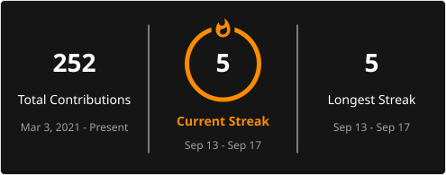

  

  

 

  

 

  <picture>
    <source media="(prefers-color-scheme: dark)" srcset="https://raw.githubusercontent.com/LyRooy/LyRooy/output/github-contribution-grid-snake-dark.svg">
    <source media="(prefers-color-scheme: light)" srcset="https://raw.githubusercontent.com/LyRooy/LyRooy/output/github-contribution-grid-snake.svg">
    
  </picture>

 

<!-- Nagłówki nad sekcjami -->

  <h3>Technology Footprint</h3>
  <h3>Languages & Tools</h3>

<!-- Widżety obok siebie: Większy Donut Chart i Tech Stack -->

  
  &nbsp;&nbsp;&nbsp;&nbsp;&nbsp;&nbsp;
  

